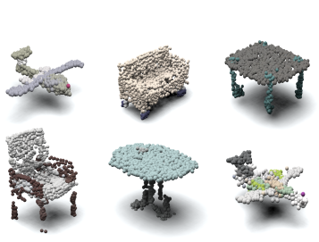

## Progressive Conditional Generative Adversarial Network

### Overview

We introduce a novel progressive conditional generative adversarial network 
(PCGAN) that creates dense 3D point clouds, with color, for assorted classes of 
objects in an unsupervised manner. To overcome the difficulty of capturing 
intricate details at high resolutions, we propose a point transformer that 
progressively grows the network through the use of graph convolutions. The 
network is composed of a leaf output layer and an initial set of branches. Every 
training iteration evolves a point vector into a point cloud of increasing 
resolution. After a fixed number of iterations, the number of branches is 
increased by replicating the last branch. 

<p align="center">

</p>

If you find this code useful, then please consider citing our work:

```                                                                                                                                                           
@inproceedings{arshad2020progressive,
  title={A Progressive Conditional Generative Adversarial Network for Generating Dense and Colored 3D Point Clouds},
  author={Arshad, Mohammad Samiul and Beksi, William J},
  booktitle={International Conference on 3D Vision (3DV)},
  year={2020}
}                                                                                                                                                             
```   

### Dependencies

PCGAN has the following dependencies:

- Python 3.6+ with Numpy, Scipy, and Matplotlib
- [PyTorch (version 1.3+)](https://pytorch.org/get-started/locally/)
- [opencv-python](https://pypi.org/project/opencv-python/)

The code has been tested with Python 3.6, PyTorch 1.3.1, and CUDA 9.2 on Ubuntu 
19.04.

### Dataset

We use the [ShapeNetCore](https://www.shapenet.org/) dataset for our 3D models. 
First, download and unzip the 3D models for the appropriate class (e.g., chair) 
in the indexed directory:

      ./datasets/shapenet/mesh/[class-id]

Next, remove all instances of models without `mtl` files and then use 
`./data/dataset_preparation.py` to extract the colored point clouds of a desired
resolution. Lastly, store the extracted point clouds in the indexed directory:

      ./datasets/shapenet/point-clouds/[class-id]

### Usage

In PCGAN, `arguments.py` contains nearly all the training parameters. To train a 
model, execute the following command: 

      python3 train.py
      

### References
PCGAN utilizes code from the following projects:

* TreeGAN: https://github.com/seowok/TreeGAN

* DGCNN: https://github.com/WangYueFt/dgcnn/tree/master/pytorch
