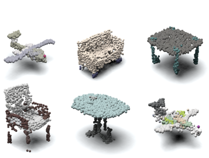
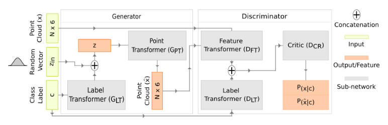

## Progressive Conditional Generative Adversarial Network

### Overview

Generating synthetic 3D point cloud data is an open area of research with the
intention of facilitating the learning of non-Euclidean point representations.
In three dimensions, synthetic data may take the form of meshes, voxels, or raw
point clouds in order to learn a representation that facilitates the solution
of computer vision tasks such as classification, segmentation, and
reconstruction Automatically synthesizing 3D point clouds can aid many
real-world applications by providing a source of potentially infinite amounts
of diverse data.

<p align="center">

</p>

This repository provides source code for our 2020 3DV paper titled "[A
Progressive Conditional Generative Adversarial Network for Generating Dense and
Colored 3D Point Clouds](https://arxiv.org/pdf/2010.05391.pdf)." Our
progressive conditional generative adversarial network (PCGAN) creates dense 3D
point clouds, with color, for assorted classes of objects in an unsupervised
manner. To overcome the difficulty of capturing intricate details at high
resolutions, we propose a point transformer that progressively grows the
network through the use of graph convolutions. The network is composed of a
leaf output layer and an initial set of branches. Every training iteration
evolves a point vector into a point cloud of increasing resolution. After a
fixed number of iterations, the number of branches is increased by replicating
the last branch. 

### Citation

If you find this project useful, then please consider citing our work.

```                                                                                                                                                           
@inproceedings{arshad2020progressive,
  title={A Progressive Conditional Generative Adversarial Network for Generating Dense and Colored 3D Point Clouds},
  author={Arshad, Mohammad Samiul and Beksi, William J},
  booktitle={Proceedings of the International Conference on 3D Vision (3DV)},
  year={2020},
  pages={712--722},
  organization={IEEE}
}                                                                                                                                                             
```   

### Model Architecture

<p align="center">

</p>

### Installation Dependencies

PCGAN has the following dependencies:

- Python 3.6+ with Numpy, Scipy, and Matplotlib
- [PyTorch (version 1.3+)](https://pytorch.org/get-started/locally/)
- [opencv-python](https://pypi.org/project/opencv-python/)

The code has been tested with Python 3.6, PyTorch 1.3.1, and CUDA 9.2 on Ubuntu 
19.04.

### Dataset

We use the [ShapeNetCore](https://www.shapenet.org/) dataset for our 3D models. 
First, download and unzip the 3D models for the appropriate class (e.g., chair) 
in the indexed directory:

      ./datasets/shapenet/mesh/[class-id]

Next, remove all instances of models without `mtl` files and then use 
`./data/dataset_preparation.py` to extract the colored point clouds of a desired
resolution. Lastly, store the extracted point clouds in the indexed directory:

      ./datasets/shapenet/point-clouds/[class-id]

### Usage

#### Model Training

In PCGAN, `arguments.py` contains nearly all the training parameters. To train a 
model, execute the following command: 

      python3 train.py
      
### References

PCGAN utilizes code from the following projects:

* TreeGAN: https://github.com/seowok/TreeGAN

* DGCNN: https://github.com/WangYueFt/dgcnn/tree/master/pytorch

### License

[](https://github.com/robotic-vision-lab/Progressive-Conditional-Generative-Adversarial-Network/blob/main/LICENSE)
